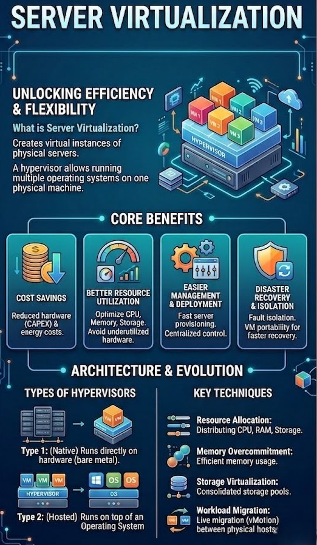
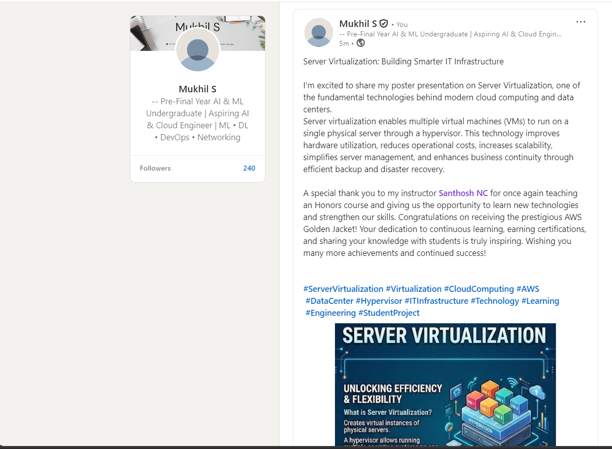

# Assignment 1: Poster Presentation & LinkedIn Post

**Name:** Mukhil S 
**Register Number:** 23am036
**Marks:** 5

## Objective
Design an attractive and informative poster.

## Topic Chosen
> Server Virtualization 

## Poster Design

*Fig 1: Final poster covering the chosen topic*

### Poster Contents
- **Title:** SERVER VIRTUALIZATION
- **Brief Explanation:** An infographic detailing the core concepts, advantages, architectural types, and foundational techniques behind server virtualization.
- **Key Points Covered:**
  - **Unlocking Efficiency & Flexibility:** Defines server virtualization as creating virtual instances of physical servers. Explains that a hypervisor allows running multiple operating systems on one physical machine.
  - **Core Benefits:**
    - *Cost Savings:* Reduced hardware (CAPEX) & energy costs.
    - *Better Resource Utilization:* Optimize CPU, Memory, Storage; avoid underutilized hardware.
    - *Easier Management & Deployment:* Fast server provisioning and centralized control.
    - *Disaster Recovery & Isolation:* Fault isolation and VM portability for faster recovery.
  - **Architecture & Evolution:**
    - *Types of Hypervisors:*
      - Type 1: (Native) Runs directly on hardware (bare metal).
      - Type 2: (Hosted) Runs on top of an Operating System.
  - **Key Techniques:**
    - *Resource Allocation:* Distributing CPU, RAM, Storage.
    - *Memory Overcommitment:* Efficient memory usage.
    - *Storage Virtualization:* Consolidated storage pools.
    - *Workload Migration:* Live migration (vMotion) between physical hosts.
## LinkedIn Post
- **Post Link:** https://www.linkedin.com/posts/mukhil77_servervirtualization-virtualization-cloudcomputing-activity-7480671763568283648-9fK5?utm_source=share&utm_medium=member_desktop&rcm=ACoAAEbPWzkBgNUq0zn8FBNvDdMch5DnBKHhDVc

*Fig 2: Screenshot of the published LinkedIn post*

## Learning Outcomes
- Gained a clearer understanding of the chosen virtualization concept while researching for the poster.
- Practiced summarizing a technical topic into concise, visually engaging content.
- Learned to communicate technical work professionally on LinkedIn.

