# Assignment 2: VirtualBox Installation with Ubuntu & CentOS

**Name:** Mukhil S 
**Register Number:** 23am036
**Marks:** 10

## Objective
Understand the basics of virtualization by installing multiple operating systems (Ubuntu and CentOS) using Oracle VirtualBox.

## Step 1: Install Oracle VirtualBox
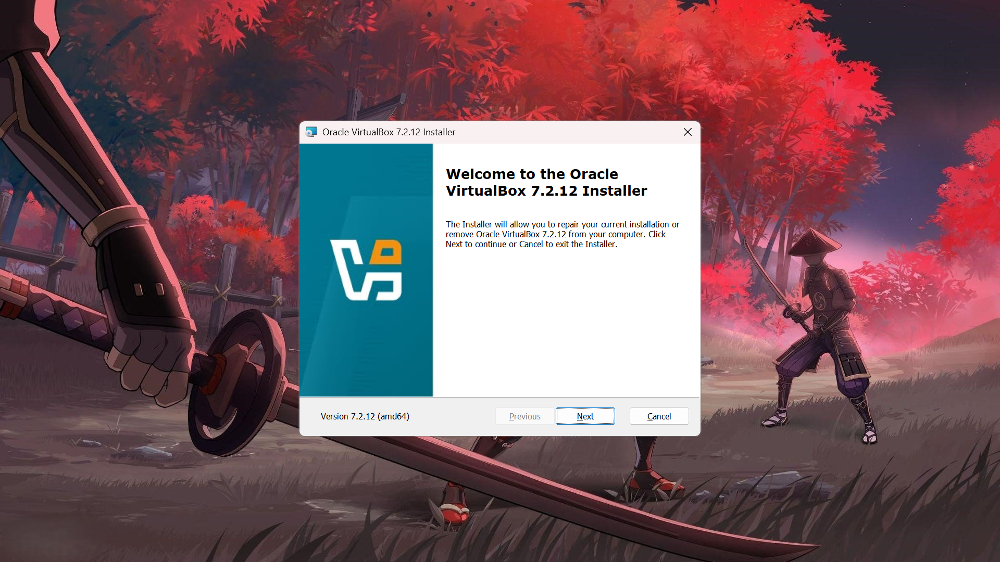
*Fig 1: Oracle VirtualBox installed successfully*

## Step 2: Create Two Virtual Machines

### Ubuntu VM
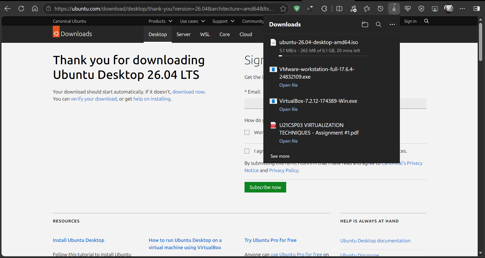
*Fig 2: Ubuntu installed and running inside VirtualBox*

### CentOS VM
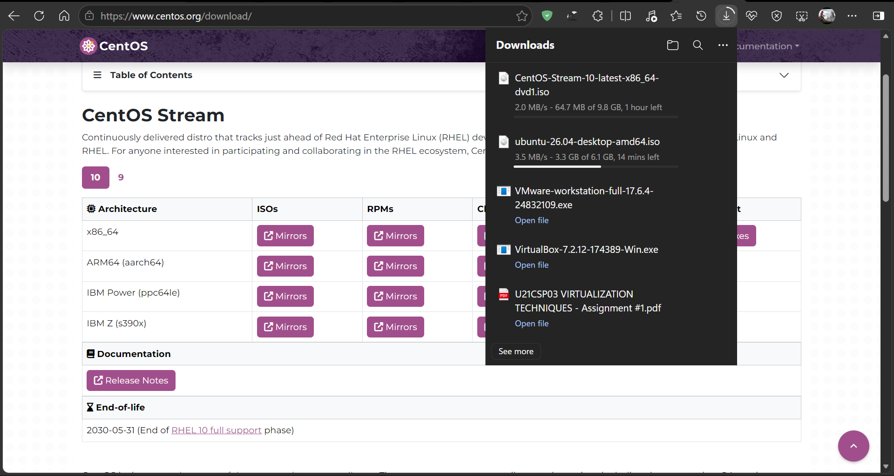
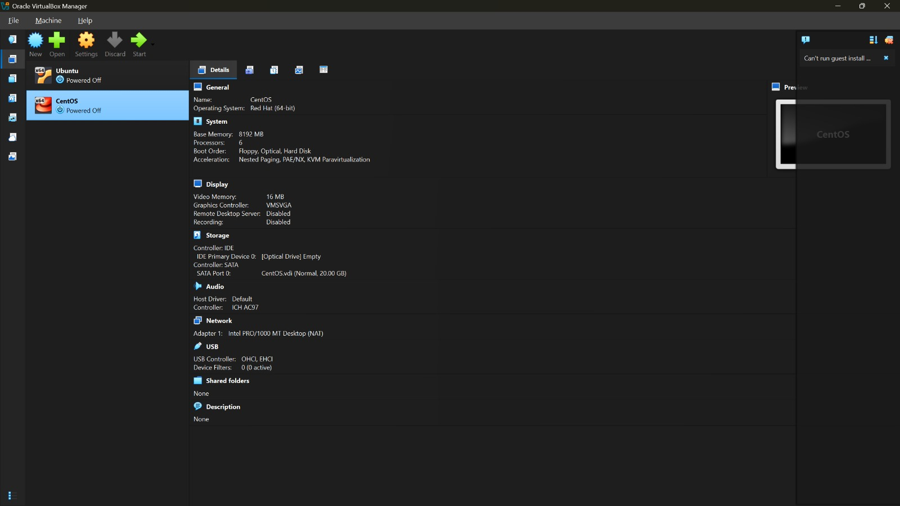
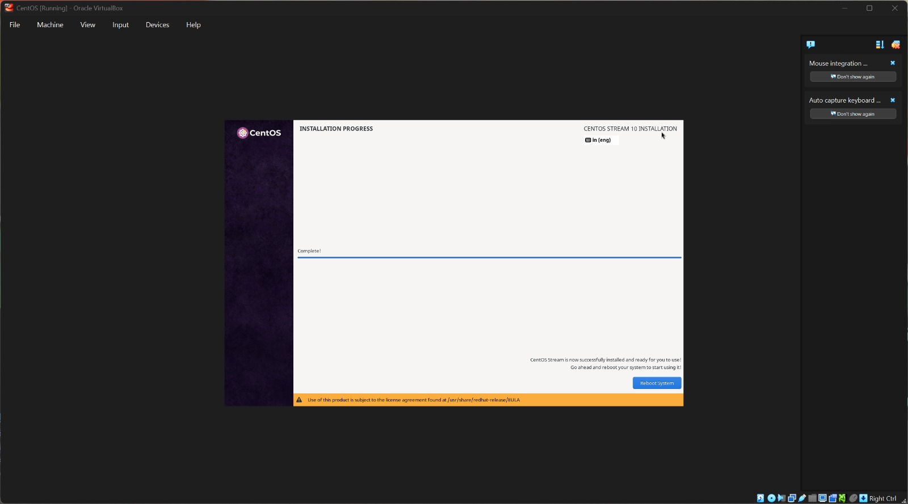
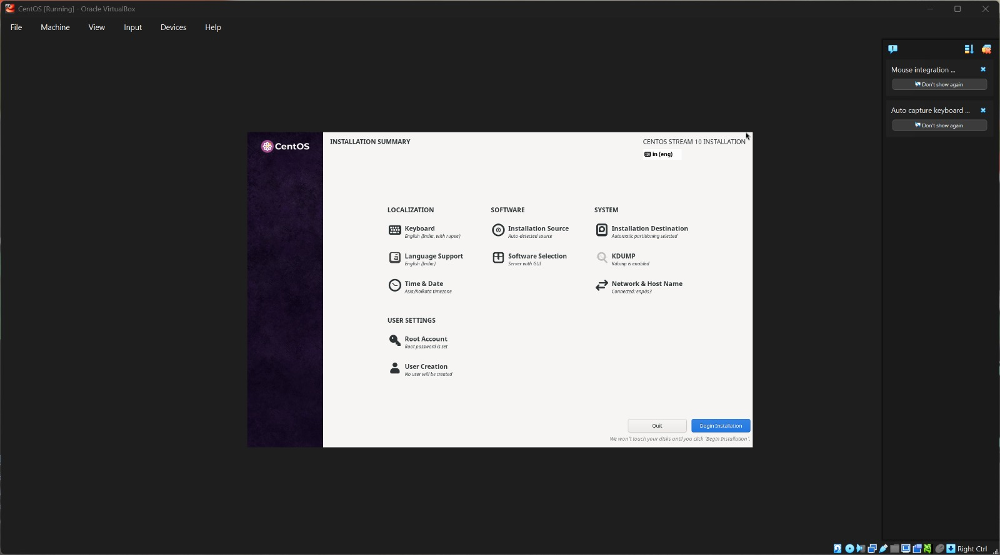
*Fig 3: CentOS installed and running inside VirtualBox*

## Step 3: Execute Linux Commands

Commands executed inside each VM:

```bash
mkdir 23am036
cd 23am036
mkdir mukhil
cd mukhil
touch sample.txt
vi sample.txt
```

Sample content added inside `sample.txt`:

```text
Name: Mukhil
Register Number: 23AM036
Department: AIML
VirtualBox Lab Assignment
```

Verified using:

```bash
cat sample.txt
```

### Ubuntu — Command Execution & Output
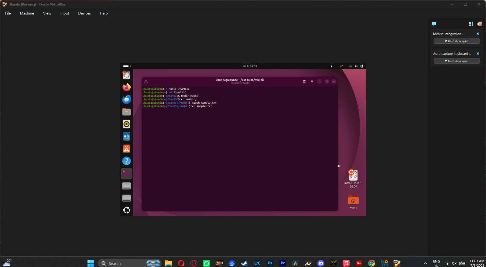
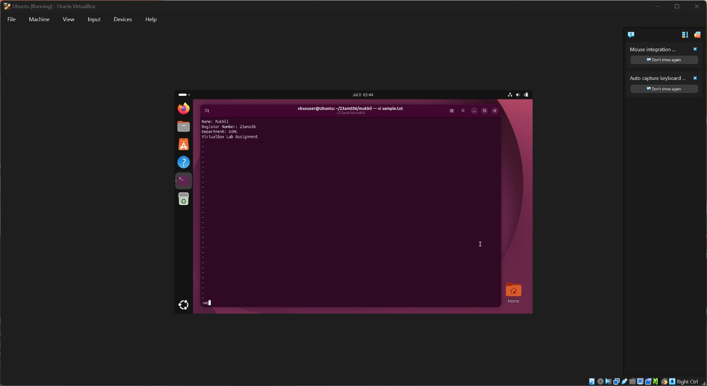
*Fig 4: mkdir, cd, touch, vi command execution on Ubuntu*

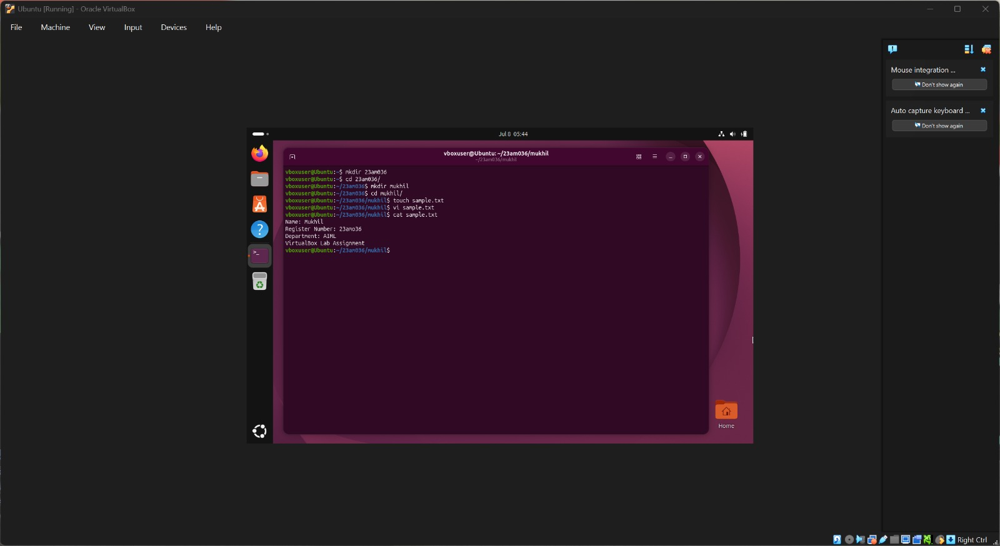
*Fig 5: cat sample.txt output on Ubuntu*

### CentOS — Command Execution & Output
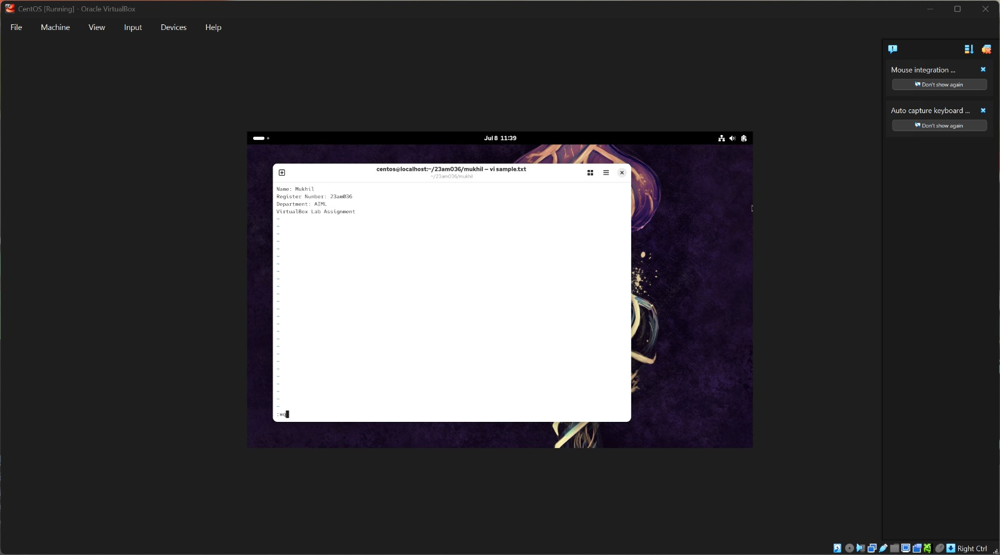
*Fig 6: vi command execution on CentOS*

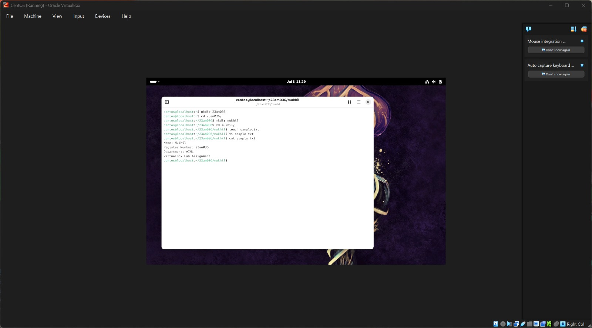
*Fig 7: cat sample.txt output on CentOS*

## Challenges Faced
- None

## Learning Outcomes
- Understood the fundamentals of Type-2 (hosted) virtualization using Oracle VirtualBox.
- Learned to create, configure, and boot virtual machines with different guest operating systems.
- Practiced essential Linux commands: `mkdir`, `cd`, `touch`, `vi`, and `cat`.
- Compared the installation and setup experience between Ubuntu and CentOS.

