# Assignment 3: VMware Workstation Installation with Windows & Ubuntu

**Name:** Mukhil S 
**Register Number:** 23am036
**Marks:** 10

## Objective
Learn desktop virtualization by installing multiple operating systems (Windows and Ubuntu) using VMware Workstation.

## Step 1: Install VMware Workstation
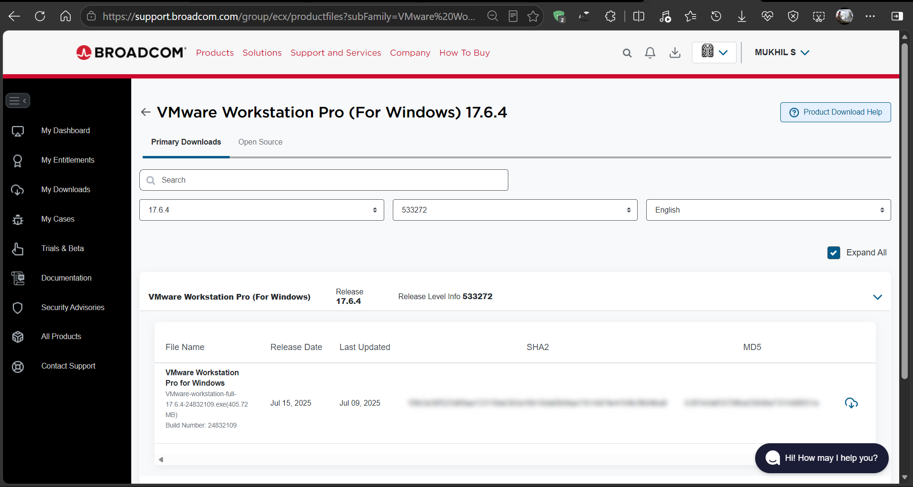
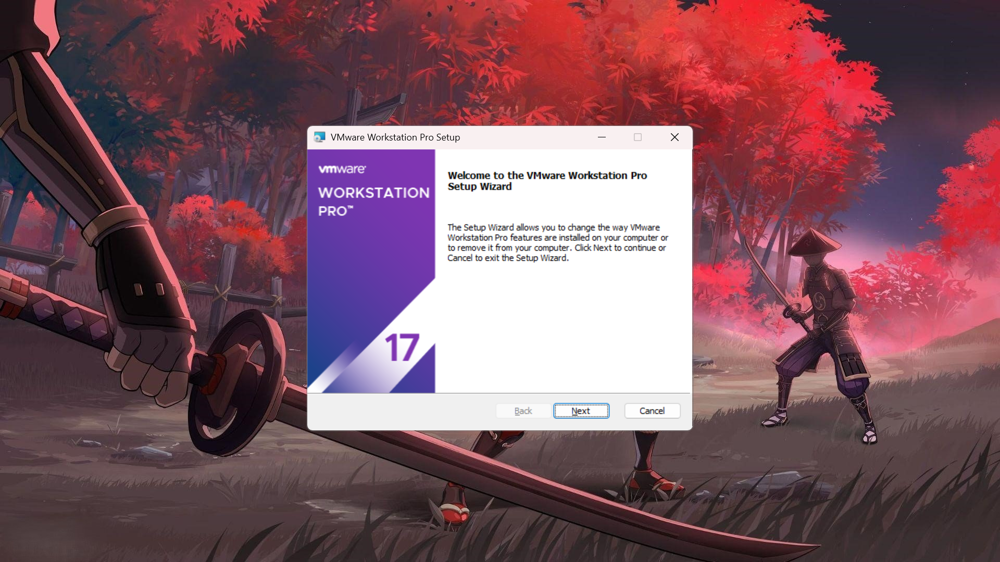
*Fig 1: VMware Workstation installed successfully*

## Step 2: Create Two Virtual Machines

### Ubuntu VM

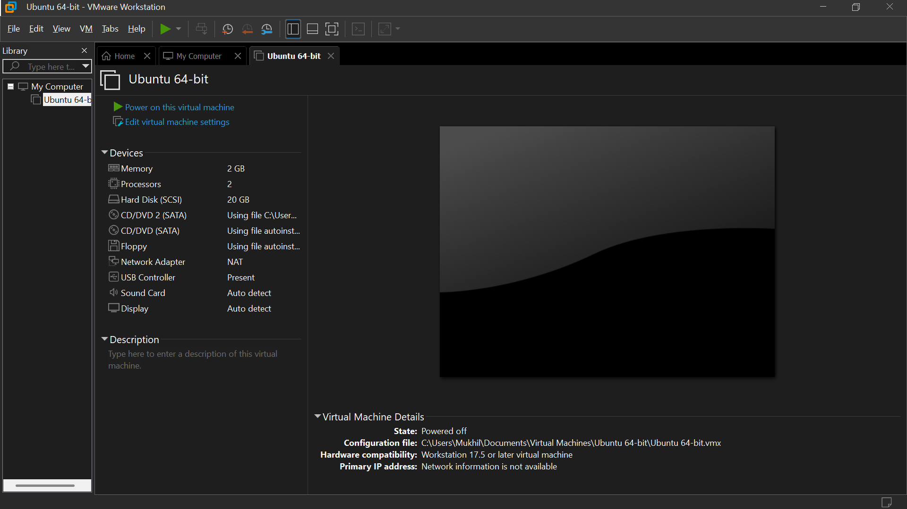
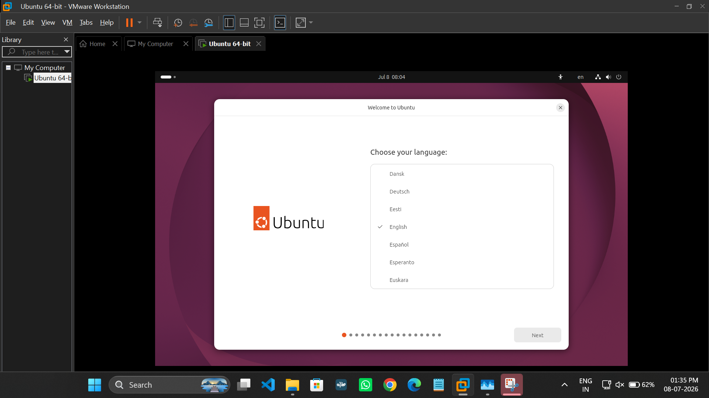
*Fig 2: Ubuntu installed and running inside VMware Workstation*

### Windows VM
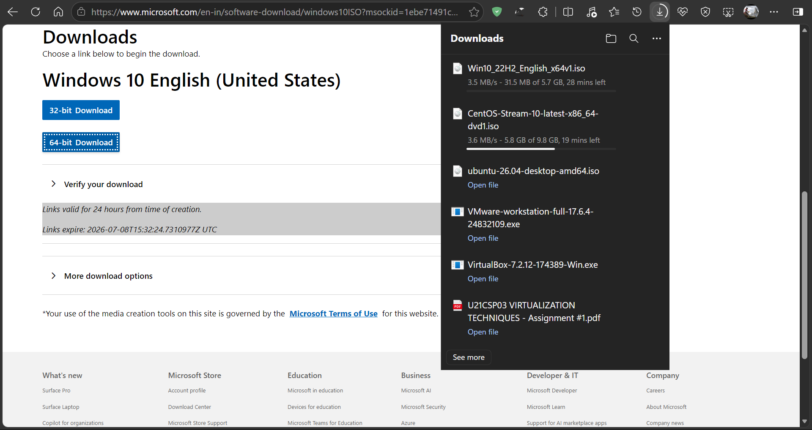
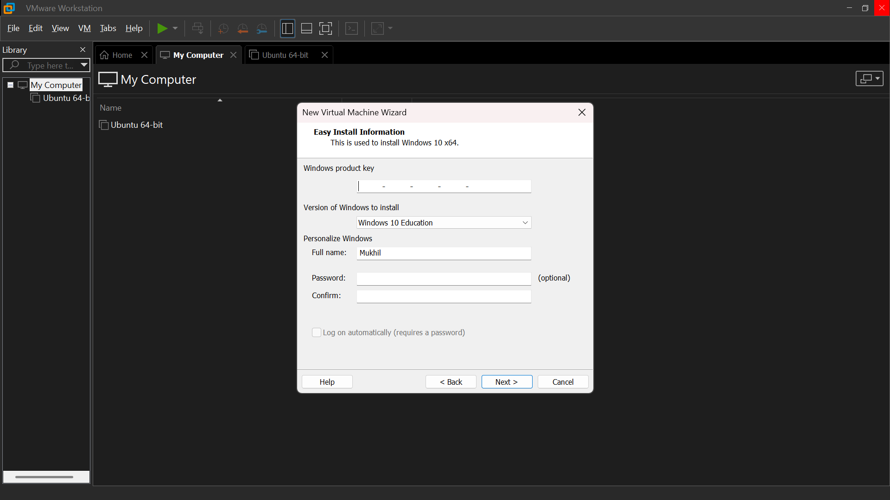
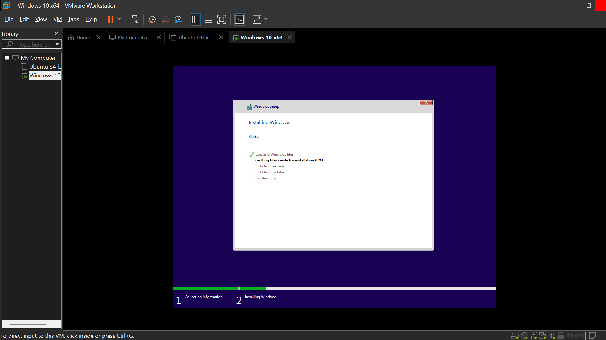
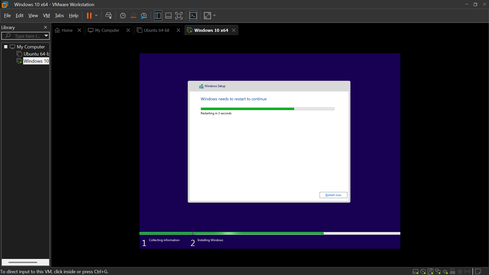
*Fig 3: Windows installed and running inside VMware Workstation*


## Step 3(i): Execute Linux Commands (Ubuntu)

Commands executed inside the Ubuntu VM:


```bash
mkdir 23am036
cd 23am036
mkdir mukhil
cd mukhil
touch sample.txt
vi sample.txt
```

Sample content added inside `sample.txt`:

```text
Name: Mukhil
Register Number: 23AM036
Department: AIML
VMware Workstation Lab Assignment
```


Verified using:

```bash
cat sample.txt
```

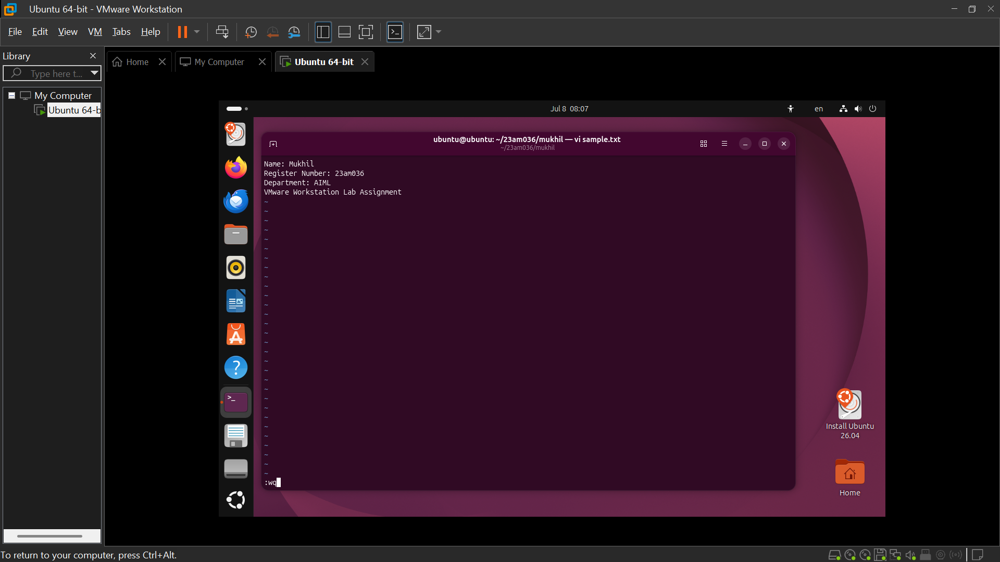
*Fig 4: vi command execution on Ubuntu*

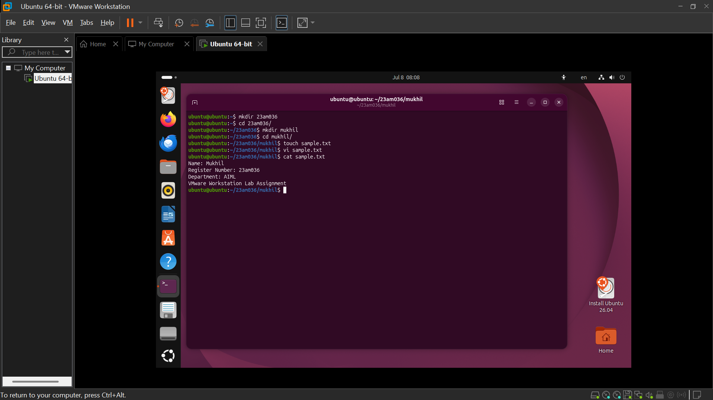
*Fig 5: cat sample.txt output on Ubuntu*

## Step 3(ii): Execute Commands (Windows)

Commands executed inside Windows Command Prompt (CMD):

```cmd
mkdir 23am036
cd 23am036
mkdir mukhil
cd mukhil
type nul > sample.txt
notepad sample.txt
```

Sample content added inside `sample.txt`:

```text
Name: Mukhil
Register Number: 23AM036
Department: AIML
Windows Command Prompt Lab Assignment
```

Verified using:

```cmd
type sample.txt
```


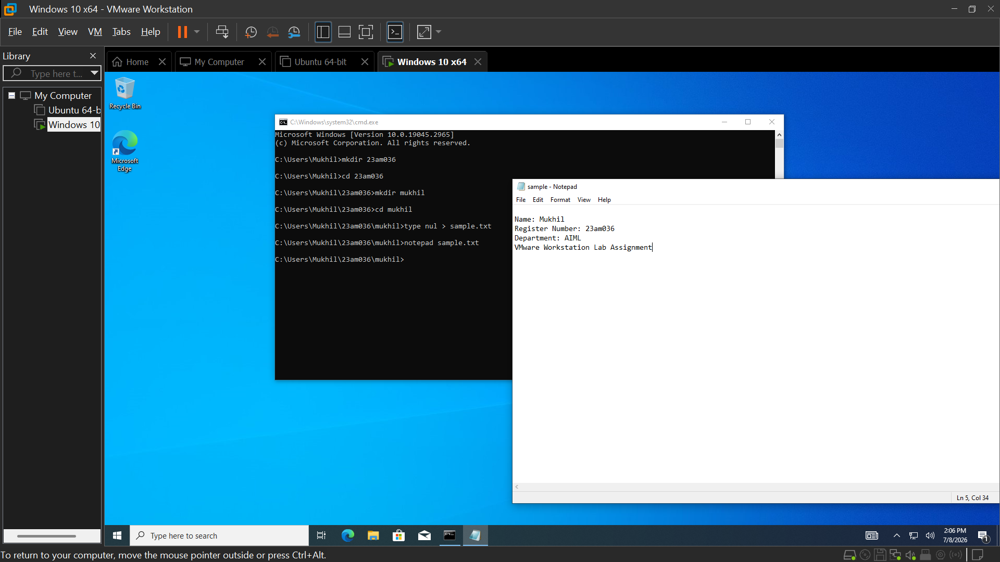
*Fig 6: Command execution on Windows Command Prompt*

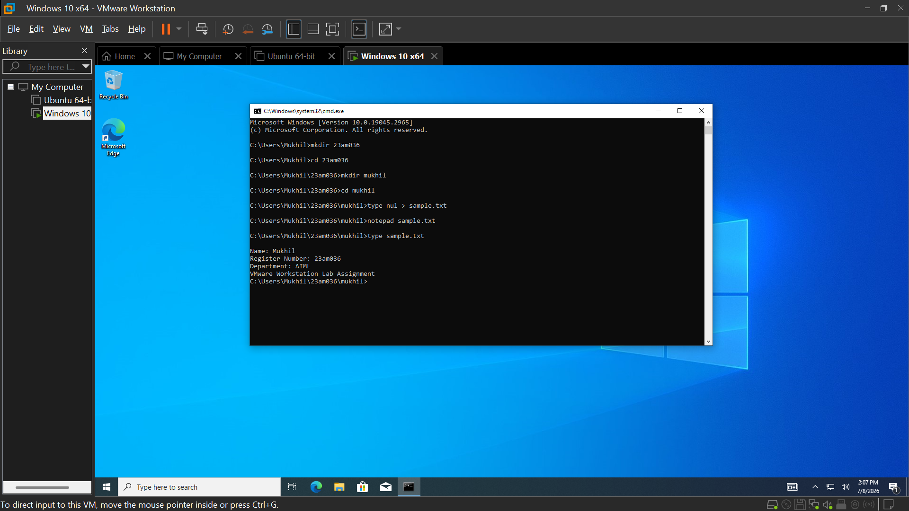
*Fig 7: Output on Windows Command Prompt*


## Challenges Faced
- None

## Learning Outcomes
- Understood desktop virtualization concepts using VMware Workstation.
- Learned to install and configure both Windows and Ubuntu as guest operating systems.
- Practiced essential Linux commands: `mkdir`, `cd`, `touch`, `vi`, and `cat`.
- Compared VMware Workstation's features with Oracle VirtualBox.