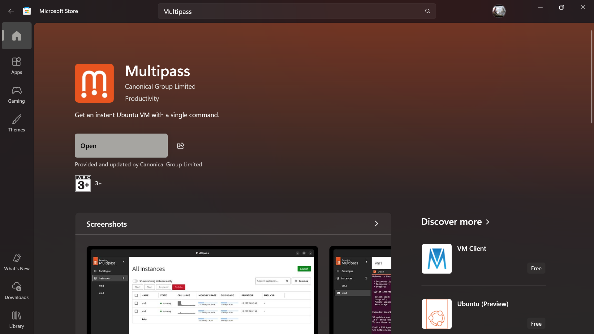
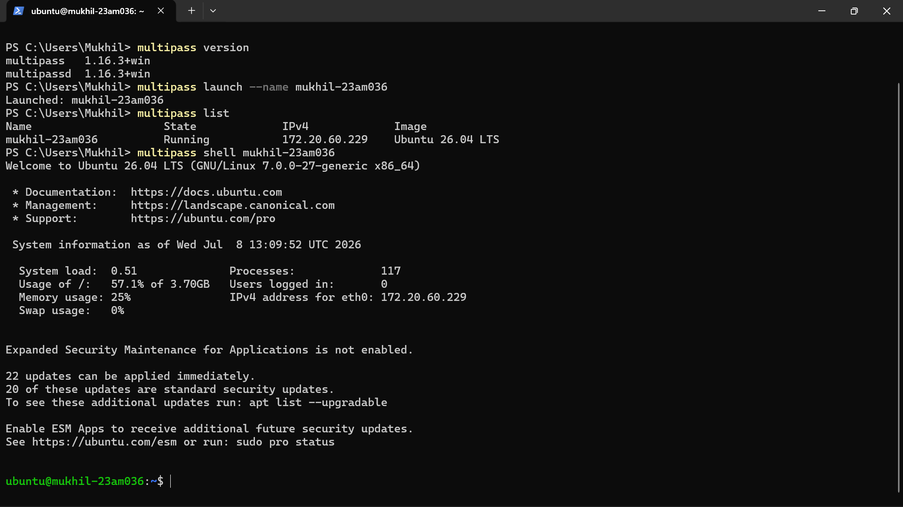
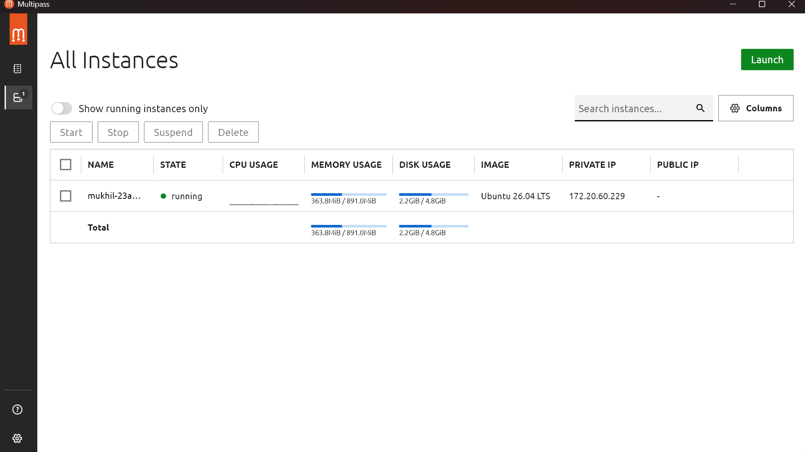
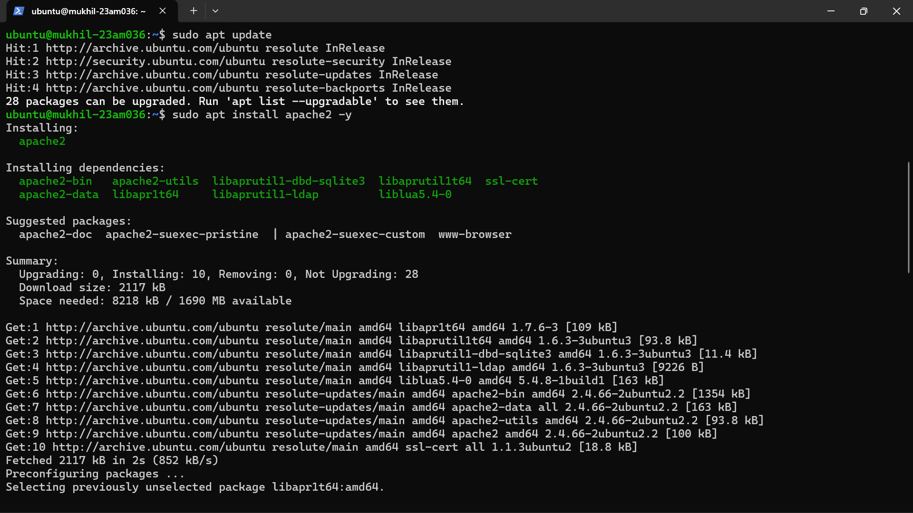
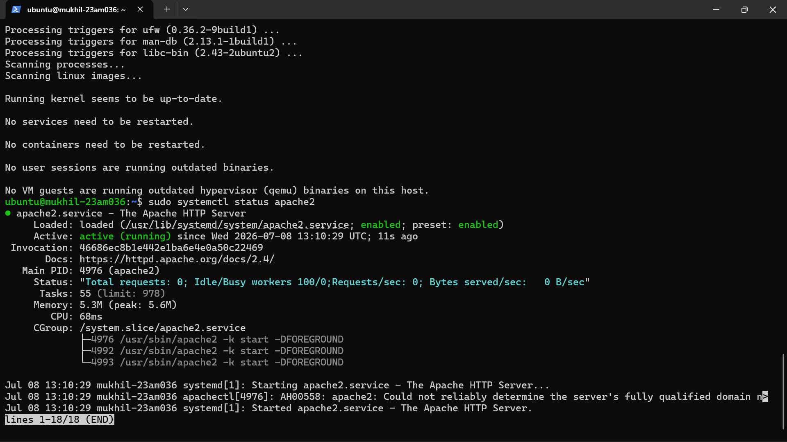
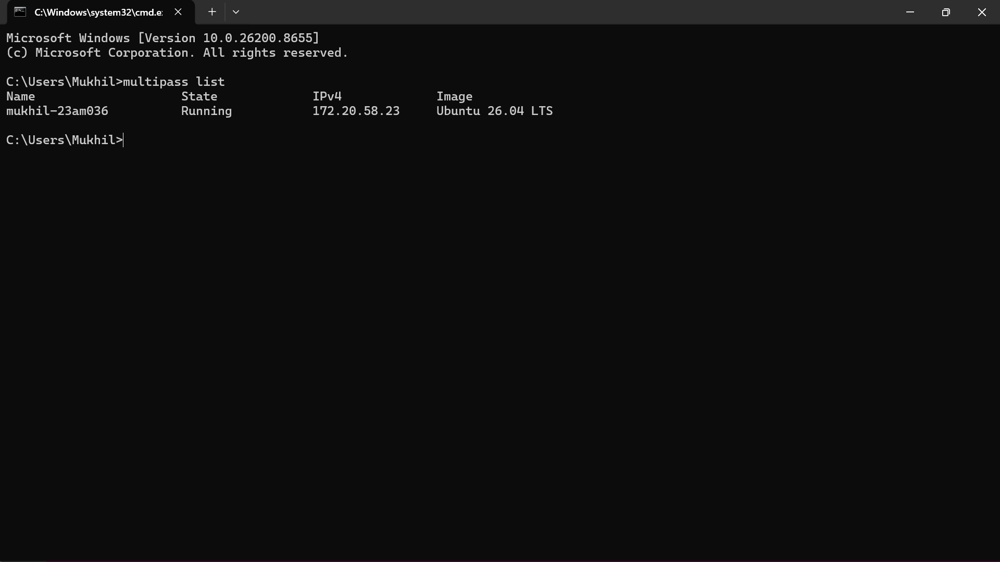
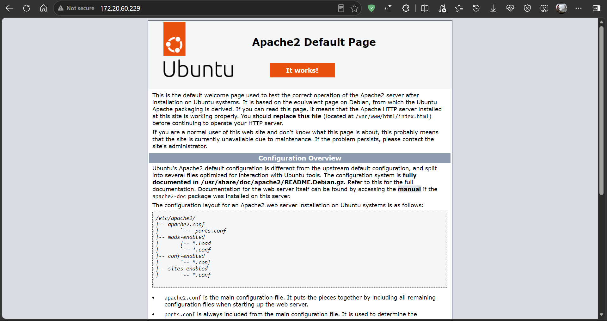
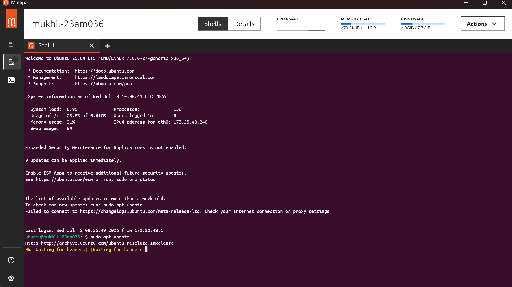

# Assignment 4: Multipass Demo for Server Management

**Name:** <Your Name>
**Register Number:** <Register Number>
**Marks:** 10

## Objective
Learn lightweight virtualization and server provisioning using Multipass.

## Step 1: Install Multipass

*Fig 1: Multipass installed successfully*

## Step 2: Create and verify Ubuntu Server Instance

##### Creating instances
Instance naming convention: `mukhil-23am036`

```bash
multipass launch --name mukhil-23am036
```
##### Verifying instances
```bash
multipass list
```




*Fig 2: Ubuntu server instance created via Multipass and verifying running instance*

## Step 3: Install a Simple Web Server

Update the package repository and install Apache inside the instance:

```bash
multipass shell mukhil-23am036
sudo apt update
sudo apt install apache2 -y
sudo systemctl status apache2
```



*Fig 3: Nginx installed and running inside the instance*


Get the instance IP address:

```bash
multipass info mukhil-23am036
```


*Fig 4: Instance IP address details*

### Browser Output

*Fig 5: Default web page accessed via the instance IP address in the browser*

## Challenges Faced


While working through this assignment, I ran into a networking issue caused by having Cloudflare running on my host machine alongside Multipass. My `sudo apt update` command inside the instance kept timing out, and I had to dig into why the VM couldn't reach the internet even though my host machine was online.

Here's what I found to be the root cause:

**1. Network Routing Conflict**
Cloudflare sets up a virtual network interface and routes all of my host's outbound traffic through its own tunnel. Normally, my host OS forwards traffic from the Multipass virtual bridge out to the internet (NAT), but with Cloudflare active, this forwarding path gets broken. As a result, traffic from my Multipass instance got trapped inside the local network bridge and couldn't reach the internet.

**2. DNS Resolution Conflict**
Both Multipass and Cloudflare tried to use port 53 on my host to handle DNS queries. Cloudflare ended up taking over port 53, which cut off the Multipass local DNS forwarder. Because of this, my instance couldn't resolve domain names at all, which is exactly why `apt update` kept timing out instead of failing with a clear network error.

**Fix:** I resolved this by temporarily pausing/disabling Cloudflare while running Multipass commands that needed internet access (instance creation, `apt update`, package installs), then re-enabling it afterward. This let both tools work without permanently conflicting with each other.

## Learning Outcomes
- Understood lightweight/container-style virtualization using Multipass.
- Learned to provision Ubuntu server instances quickly from the command line.
- Practiced installing and verifying a web server (Nginx/Apache) on a cloud-style instance.
- Learned to access services running on a VM instance via its IP address.

