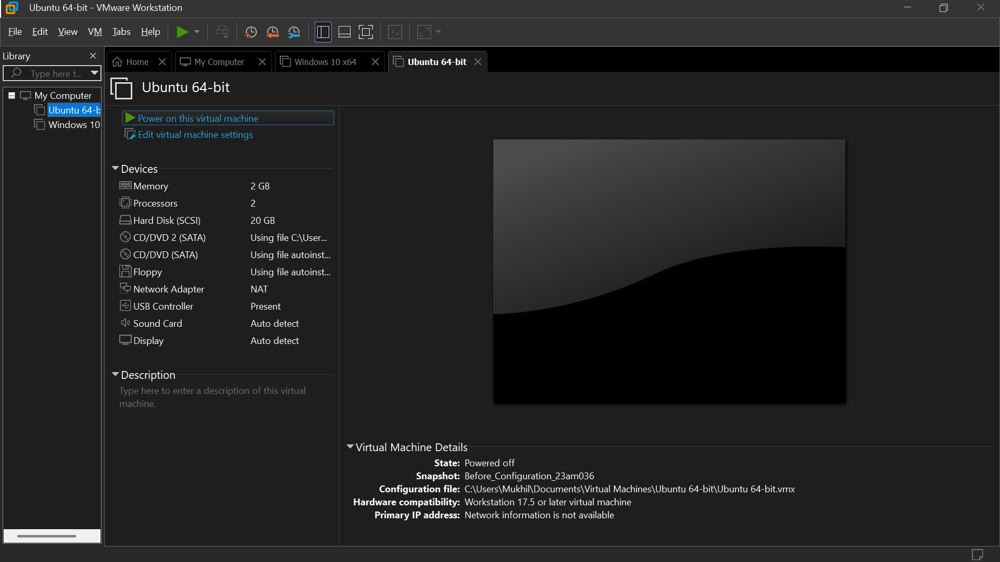
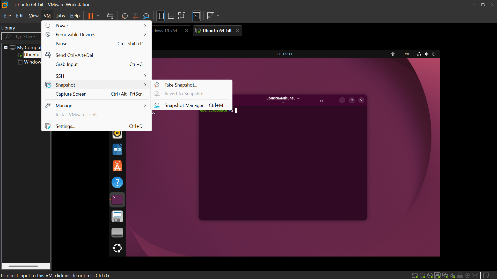
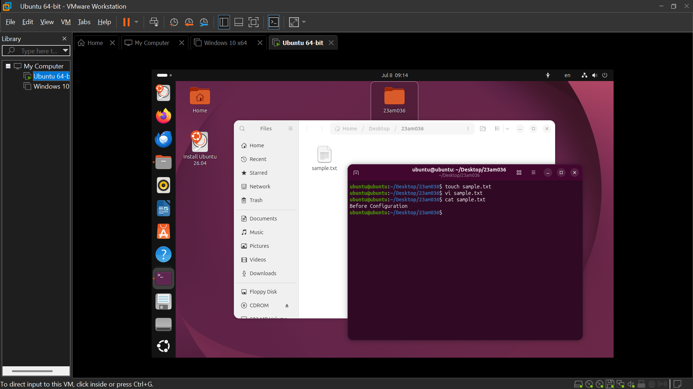
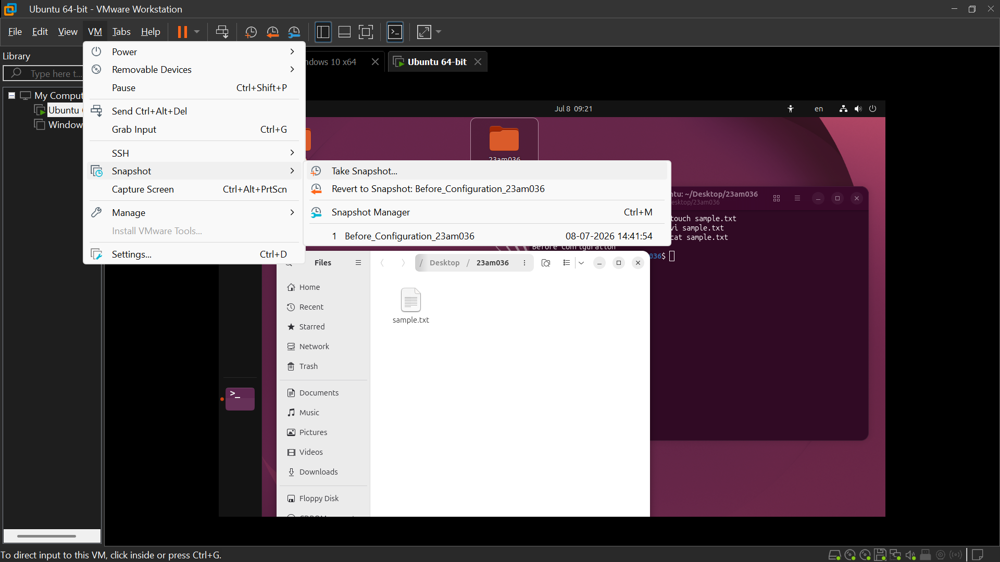
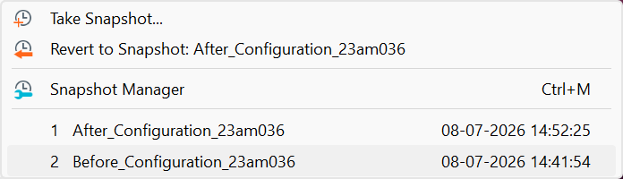
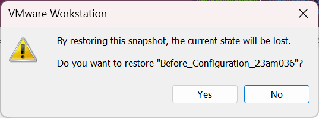
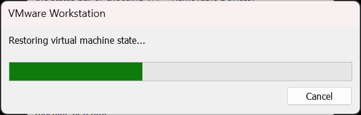
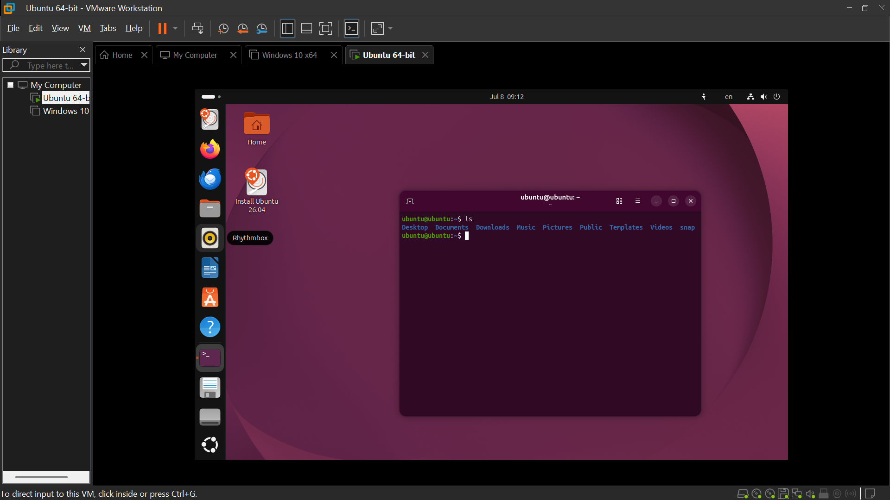
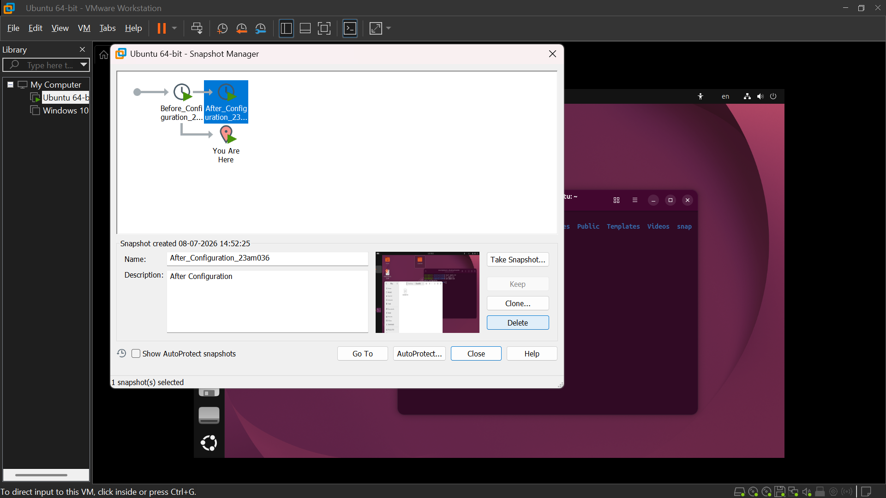
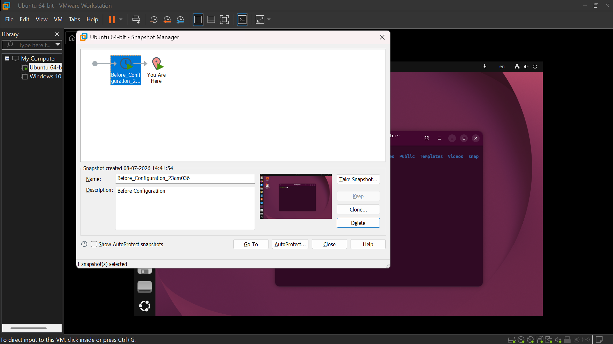

# Assignment 5: Virtual Machine Snapshot Management

**Name:** Mukhil S 
**Register Number:** 23am036
**Marks:** 5

## Objective
Learn how to create, manage, restore, and delete snapshots in a Virtual Machine to understand backup and recovery concepts.

## Virtual Machine Details
- **VM Used:** Ubuntu 
- **Hypervisor:** VMware Workstation

## Step 1: Start the Virtual Machine
The virtual machine created in a previous assignment was used for this task.

## Step 2: Create the First Snapshot

Snapshot name: `Before_Configuration_23am036`

*Fig 1: "Before_Configuration_23am036" snapshot created*

## Step 3: Make Changes to the VM

Change performed: Created a new folder on Desktop, created a text file

*Fig 2: Changes made inside the VM after the first snapshot*

## Step 4: Create the Second Snapshot

Snapshot name: `After_Configuration_23am036`

*Fig 3: "After_Configuration_23am036" snapshot created*

## Step 5: Restore the First Snapshot

The `Before_Configuration_23am036` snapshot was restored, and the changes made afterward were verified to be reverted.

*Fig 4: VM restored to "Before_Configuration_23am036" state*

*Fig 5: Verification that changes made after the first snapshot are no longer present*

## Step 6: Delete the Second Snapshot

The `After_Configuration_23am036` snapshot was deleted, and the snapshot list was verified.

*Fig 6: "After_Configuration" snapshot deleted and snapshot list verified*

## Concepts

### What is a Snapshot?
A snapshot captures the complete state of a virtual machine — including its disk, memory, and configuration — at a specific point in time, allowing the VM to be reverted back to that exact state later.

### Advantages of Snapshots
- Quick to create and restore compared to full backups.
- Useful for testing changes safely before committing to them.
- Enables fast recovery from configuration errors or failed updates.
- Supports multiple restore points (a snapshot tree) for a single VM.

### Difference Between Snapshot and Backup
| Aspect | Snapshot | Backup |
|---|---|---|
| Storage | Stored alongside the VM, depends on the original disk | Independent, standalone copy of data |
| Speed | Fast to create/restore | Slower, involves full data copy |
| Purpose | Short-term, for testing/rollback | Long-term data protection and disaster recovery |
| Dependency | Depends on the original VM/disk to function | Can be restored independently, even on a different system |
| Storage Space | Grows over time as changes accumulate | Fixed size at time of backup |

## Challenges Faced
- None

## Learning Outcomes
- Learned to create and manage virtual machine snapshots.
- Practiced restoring a virtual machine to a previous state.
- Understood the importance of snapshots in testing, troubleshooting, and disaster recovery.
- Differentiated between snapshots and traditional backups.

